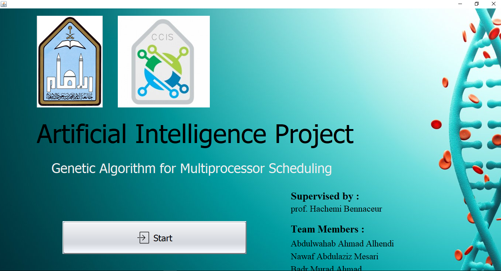
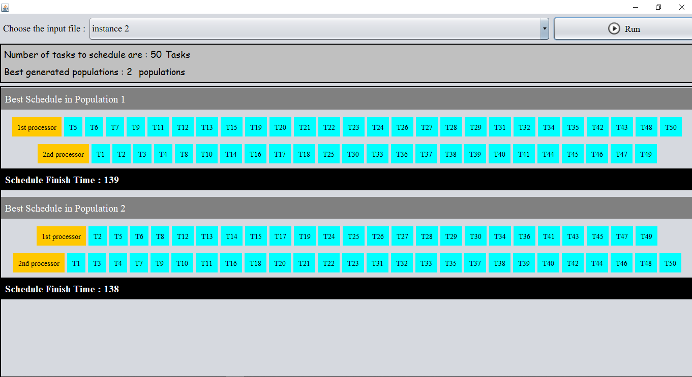
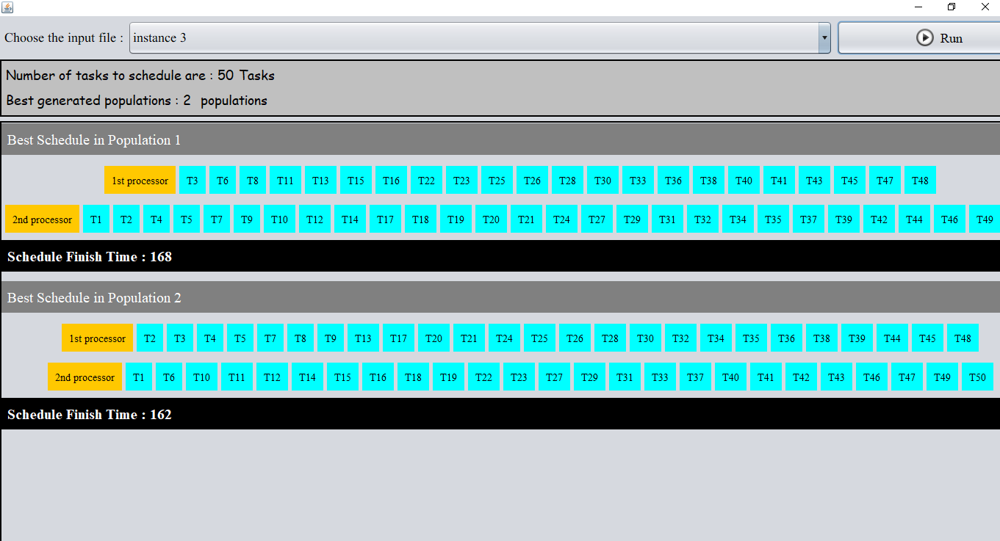

# A-Genetic-Algorithm-for-Multiprocessor-Scheduling

In terms of CPU scheduling methodology, we are trying to schedule a bunch of tasks and distribute them onto 2 processors system in an efficient way so that the execution time of all tasks would be optimized.

